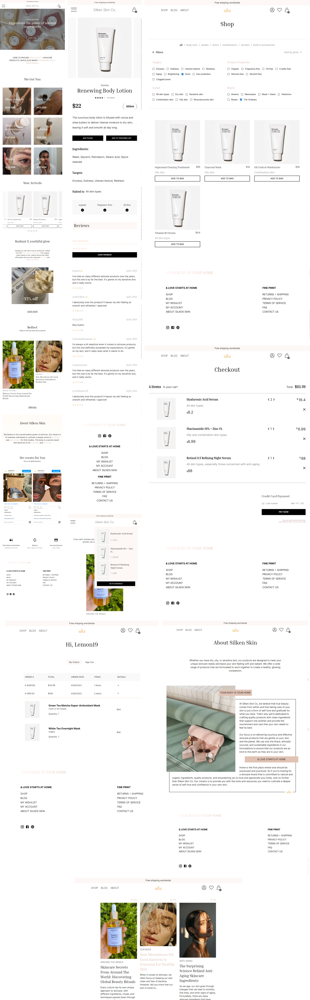

# Silken Skin Co Store

Silken Skin Co Store is an ecommerce website that specializes in selling skincare products. The main goal of the website is to provide a convenient and easy-to-use platform for customers to buy their favorite skincare products from the comfort of their own home.

## Table of contents

- [Silken Skin Co Store](#silken-skin-co-store)
    - [Table of contents](#table-of-contents)
    - [Overview](#overview)
        - [Built with](#built-with)
        - [Features](#features)
        - [Screenshots](#screenshots)
        - [Live URL](#live-url)
    - [My process](#my-process)
        - [What I learned](#what-i-learned)
        - [Optimizations](#optimizations)
    - [Installation](#installation)
    - [Bugs or possible issues](#bugs-or-possible-issues)
    - [Contributing](#contributing)
    - [License](#license)

## Overview

### Built with

- Vite
- TypeScript
- React
- Redux Toolkit
- localStorage
- React router dom
- Stripe
- Firebase
- Firebase Auth
- CSS Modules
- PostCSS
- CSS custom properties
- Material UI
- Grid
- Flexbox

### Features
Here are some of the key features of Silken Skin Co Store:

**Browsing:** Users can browse through the home page to see different
categories, new products, new blog posts, Instagram posts, and learn more about the company.

**Authentication:** Users can create an account or log in using their email and
password, or their Google account. This feature is implemented using Firebase Auth and Redux state.

**Shopping Cart:** Users can add products to their shopping cart and see a 
number of products that is already in it.

**Checkout:** From Shopping Cart a user can go to Checkout page to add more 
products, or remove them and
complete their purchase.

**Payment:** Payment is implemented using Stripe, providing a secure and easy
way for customers to pay for their orders.

**Wishlist:** Users can add products to their wishlist.

**Order History:** If a user is logged in while making an order, they will be
able to see their order history in their profile account.

**Reviews:** Users can leave reviews for products they've purchased. If a user
is logged in and has purchased the product, a verified purchase icon will appear next to their name. Otherwise, the icon won't appear. Reviews can include a rating from 0.5 to 5 stars, and a written review. After a review is submitted, the average star rating for that product is updated.

**Filters:** Users can filter products based on 7 main categories, as well as
additional filters for targets, properties, skin types, and brand. Products can also be sorted by price.

**Blog:** Users can read the Silken Skin Co Store blog to learn more about
skincare and related topics.

**Storage and states:** Products, users, orders, reviews, and blog posts are
stored in Cloud Firestore, while the wishlist is stored in local storage.
States are handled with Redux.

### Screenshots



### Live URL

- [Live URL](https://silken-skin.netlify.app/)

## My process

### What I learned

During the development of Silken Skin, I played a lot and learned a lot. 

I found Vite to be a game changer in terms of speed, allowing me to start and work on the project with ease.


In order to strengthen my skills, I spent time rewriting states and exploring different state management options, from React Context to pure Redux, and ultimately to Redux Toolkit. While I found pure Redux to be complex, I believe it is vital and interesting to understand how Redux Toolkit streamlines the process.

I decided to try out Webstorm instead of using VS Code since 
Silken 
Skin was no 
small 
undertaking. With the 
added benefits of TypeScript, the whole process became even more engaging.

Firebase and Stripe really expanded the way I think and I took the chance to 
experience Netlify's serverless functions.

I also took a step back from the BEM methodology to lean more onto CSS modules,
which provided a great level of organization. But still I found that BEMs
descriptive classes offer invaluable clarity.

I played with my own components and also made use of various packages like 
Material UI and so on..


Silken Skin has been a rewarding learning experience for me. From 
exploring new technologies and packages to experimenting with different 
approaches, this project has allowed me to grow so I'm happy to be creating 
this 
repository.


## Optimizations

Optimizing the performance and SEO of a website is crucial for improving its visibility and usefulness to a wider audience.

## Installation

To get started with the project, simply clone the repository and install the required dependencies by running the following command:

```shell
npm install
```

Once the installation is complete, you can start the development server by running the following command:

```
npm run dev
```

## Bugs or possible issues

**Note**: The code in this project has gone through several iterations as I 
experimented with different technologies, approaches and packages. As a 
result, the code may not be entirely consistent throughout.

## Contributing

Contributions are welcomed to Silken Skin Co Store! If you'd like to 
contribute, please fork the repository and make a pull request explaining what you improved.

## License

Licensed under the MIT License.
